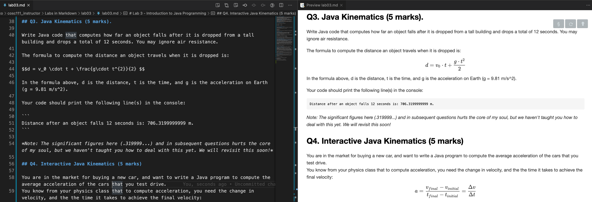

# Lab 3

In this lab, you will write a series of Java programs to solve the problems below.
The focus of this lab is to get you familiar running, and debugging your Java programs, and to get you used to the coding workflow.
For this lab, we have given you some boilerplate code (Q1.java, Q2.java, etc...) so it is easier for you to focus on the useful parts of Java coding.

We are expecting you to commit your work often with useful commit messages.
This means that **at least** after attempting each question, you should commit and push your changes to the repository.
Repositories that have very few commits will be flagged for careful scrutiny and review, and you will **definitely** lose marks for this!

Note: You may find it useful to install this [VS Code Extension](https://marketplace.visualstudio.com/items?itemName=shd101wyy.markdown-preview-enhanced) to render all the math equations in this lab.
Here is what the Markdown preview looks like with the extension enabled (Press Ctrl/Command + K and then press v).



## Q1. Print UBCO in the Console (5 marks). 

Write a program that displays the following pattern:

```
U   U   B B       C C     O O
U   U   B   B   C       O     O
U   U   B B     C       O     O
U   U   B   B   C       O     O
 U U    B B       C C     O O
```

## Q2. Calculate Area and Perimeter (5 marks).

Write Java code to **calculate** and display the area and perimeter of a rectangle that has a width of 7 and a height of 9.

Your code should print the following line(s) in the console:

```
The area is: 63
The perimeter is: 32
```

*Hint: Do not just print out the area (63) or the perimeter (32) as a string, this must be a calculation.*

## Q3. Java Kinematics (5 marks). 

Write Java code that computes how far an object falls after it is dropped from a tall building and drops a total of 12 seconds. You may ignore air resistance.

The formula to compute the distance an object travels when it is dropped is:

$$d = v_0 \cdot t + \frac{g\cdot t^{2}}{2} $$

In the formula above, $d$ is the distance, $t$ is the time, and $t$ is the acceleration (on Earth $g = 9.81 m/s^2$).

Your code should print the following line(s) in the console:

```
Distance after an object falls 12 seconds is: 706.3199999999 m.
```

*Note: The significant figures here (.319999...) and in subsequent questions hurts the core of my soul, but we haven't taught you how to deal with this yet. We will revisit this soon!*

## Q4. Interactive Java Kinematics (5 marks)

You are in the market for buying a new car, and want to write a Java program to compute the average acceleration of the cars that you test drive.
You know from your physics class that to compute acceleration, you need the change in velocity, and the the time it takes to achieve the final velocity:

$$a = \frac{v_{final} - v_{initial}}{t_{final} - t_{initial}} = \frac{\Delta v}{\Delta t} $$

The first car you test is the Tesla Model S and want to figure out its acceleration, given the starting velocity, ending velocity and the time it took to achieve the final velocity.

Write Java code that requests from the user the starting velocity $v_i$, the final velocity $v_f$ in metres per second, and the time $t$ (in seconds) to calculate the average acceleration.

After accepting the user input, your code should print the following lines in the console:

```
The average acceleration is: ZZ.ZZZZZ m/s^2.
```

Where ZZ.ZZZZZ is your computed average acceleration (based on the supplied numbers).

## Q5. Interactive Fuel Economy (5 marks)

Another factor that is very important when buying a vehicle is fuel economy.
In Canada, fuel economy is usually measured in the litres of gasoline required to drive 100 km (L/100 km).
Typical reasonable ranges for fuel economy are 0 (for electric cars) to 15 L/100km. 

Write Java code that calculates the total cost of a road trip using the user-supplied input values for the fuel cost ($/L), distance travelled (in km) and fuel economy (L/100 km).

After accepting the user input, your code should print the following lines in the console:

```
The total cost of a XX km road trip, with fuel economy YY L/100 km, and an average fuel cost of $N.NN/L is: $ZZ.ZZ.
```

Where XX is the user input of the road trip distance in kilometres (km), YY is the fuel economy in L/100, and N.NN is the fuel cost ($/L) and ZZ.ZZ is the computed total trip cost.

## Q6. Euclidean Distance (5 marks)

Write Java code that computes the distance between two specified points, (x1, y1) and (x2, y2). 
The formula to calculate the Euclidean distance between two points (($x_1$,$y_1$) and ($x_2$,$y_2$) is: 

```
\sqrt{(x_2-x_1)^2 + (y_2-y_1)^2}
```

Your code should print the following lines in the console:

```
Enter x1 and y1: 5 10
Enter x2 and y2: 10 15
The distance of the two points is 7.0710678118654755
```

*Hint: You may find the Java method Math.sqrt(a) useful.*

## Grading area

### Link to files

You do not have to do anything in this section.

[Q1 Java file](./Q1.java)

[Q2 Java file](./Q2.java)

[Q3 Java file](./Q3.java)

[Q4 Java file](./Q4.java)

[Q5 Java file](./Q5.java)

[Q6 Java file](./Q6.java)

