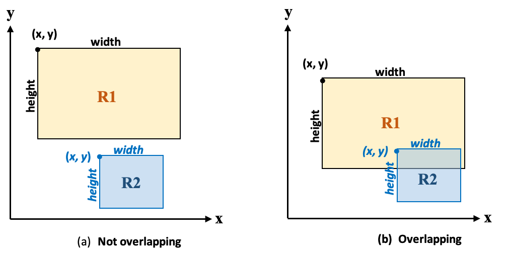

# Lab 6

There was no Lab 5 because Week 5 was Reading Week.

## Expectations

We are expecting you to commit your work often with useful commit messages.
This is helpful for you so that there are regular commits that demonstrate your progress. 
In case you forget to push your final commits before the deadline, at least you will get partial marks.

This means that you should commit and push your changes to the repository at least **FIVE** times as you work this lab (more is recommended).
Repositories that have very few commits will be flagged for careful scrutiny and review, and you will **definitely** lose marks for this! 

## Q1: [3 marks] Ascending order

**Create a program that prompts the user to enter three integers and display them in an ascending order.**

### Sample run:

```
Enter three integers: 5 2 9
The sorted numbers: 2 5 9
```

## Q2: [6 marks] Heads or Tails

**Write a program that randomly generates a character ‘H’ or ‘T’, which represents head or tail. The program then prompts the user to enter a guess and reports whether the guess is correct or incorrect.**

Hints: 
- In order to generate a random character, first generate a random number, 0 or 1, using the Math.random() method, and then use a selection block to map 0 to ‘H’ and 1 to ‘T’. 
- For reading a character from a user, first read a string using a Scanner instance and then take the first character using charAt() method.

### Sample run:

```
Guess head or tail (H or T)? H
Correct! You can read my mind.
```

Another run:

```
Guess head or tail (H or T)? H
Sorry, it was tails.
```

## Q3: [6 marks] Deck of Cards

Write a program that simulates picking a card from a deck of 52 cards. Your program should display the rank (Ace, 2, 3,..., Jack, Queen, and King) and suit (Clubs, Diamonds, Spades and Hearts) of the card.

Hint: 
- Generate a random number from 0 to 51, where 0 represents first card in the deck, and 51 the last card. Then, use the % and / to find the rank and suit respectively. The divisor is 13.

### Sample run:

```
The card you picked is a 6 of Hearts
```

## Q4: [6 marks] Overlapping rectangles

Write a program that prompts the user to enter the top left corner (x,y), width w, and height h of two rectangles and determines whether they overlap.
Two rectangles do not overlap when "one rectangle is above the top edge of the other rectangle" or "one rectangle is on the right side of the right edge of the other rectangle".




## Submission Instructions 

For this Lab, you need to do the following: 

1. Create one `.java` file for each of the questions in this lab (`Q1.java`, `Q2.java`, `Q3.java`, etc...) 
1. Answer all the questions in the appropriate java file.
1. Link your Java files in this README file (please change the links below if your file names are different).
1. Submit your repo URL to Canvas before the deadline (we will mark the last commit before the deadline)

## Grading area

### Link to files

You do not have to do anything in this section.

[Q1 Java file](./Q1.java)

[Q2 Java file](./Q2.java)

[Q3 Java file](./Q3.java)

[Q4 Java file](./Q4.java)

[Q5 Java file](./Q5.java)

Remember to commit all your changes and to submit the link to this repository on Canvas.