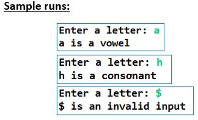
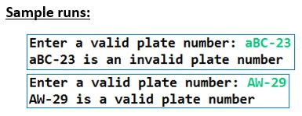
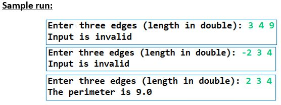
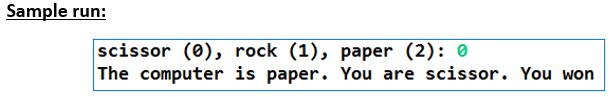
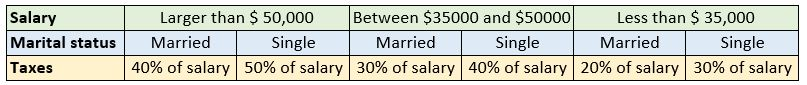
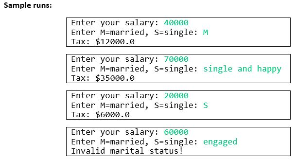

# Lab 6 

There was no Lab 5 because Week 5 was Reading Week.

Title: Relational and Logical Operators; Selection Using If and Switch 

## Q1: [7 marks] Vowel Checker

Write a Java program that takes a letter as input, and then checks whether the letter is a vowel (i.e., one of a, e, i, o, u) or a consonant. If the letter is not a valid alphabet character, print an error message stating so. 

## Q2: [7 marks] License Plate Checker

Assume vehicle plate numbers use the following standard: 

XB-23 (any two letters followed by any two digits).

Write a Java program that reads a plate number provided by the user, and then validates the plate number by ensuring it: 

- Has exactly five characters
- Starts with two uppercase letters, followed by a dash, and finally two digits.

Finally, print a message stating whether the plate number is valid or not.

## Q3: [8 marks] Better Perimeter Checker

Write a Java program that validates the perimeter of a triangle. 

The program should receive (from the user) the length of each of the three sides of a triangle as a double value. 

Then, the values should be validated using the following criterion: 

- The length of all sides have a positive value 
- The sum of any two (out of three) sides should be greater than the remaining side.

## Q4: [8 marks]

Write a Java program that plays the popular Rock-Paper-Scissors game against the computer. 

The rules of the game are:

- Scissor can cut paper, 
- Rock can knock scissors, 
- Paper can wrap a rock 

The program should randomly generate a number 0, 1, or 2 representing rock, paper, and scissors. 

The program prompts the user to enter a number 0, 1, or 2 and displays a message indicating whether the user or the computer wins, loses, or forces a tie.

## Q5: [10 marks]

Write a Java program that reads a user’s salary (double) and marital status (single character: S for single or M for married) then displays the taxes according to the rules in the table below. 

For example, a married person whose salary is $40,000 should pay \$12,000 in taxes (i.e. 30% of \$40,000). 

Display an error message if the user enters an input that doesn’t start with M or S. When reading the marital status, extract the first character from the user’s input. 

For example, all of these inputs count as married: "M", "m", "married", "Married", "M_any_characters   "; 

For example, all these inputs count as single: "S", "s", "single", "Single", "    S_any_characters   ".

