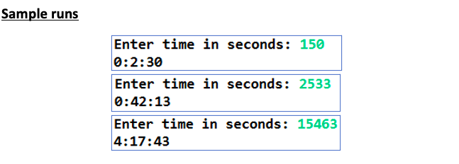
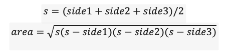
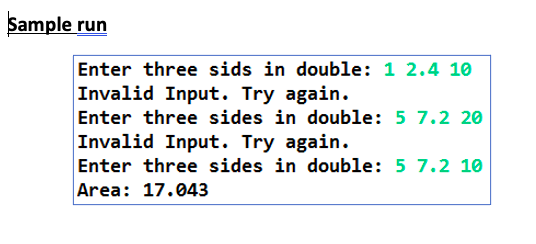
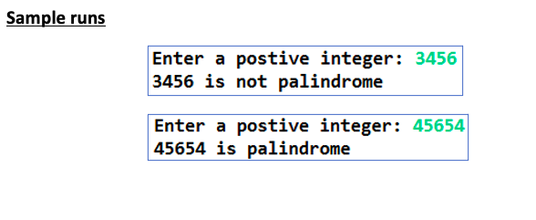
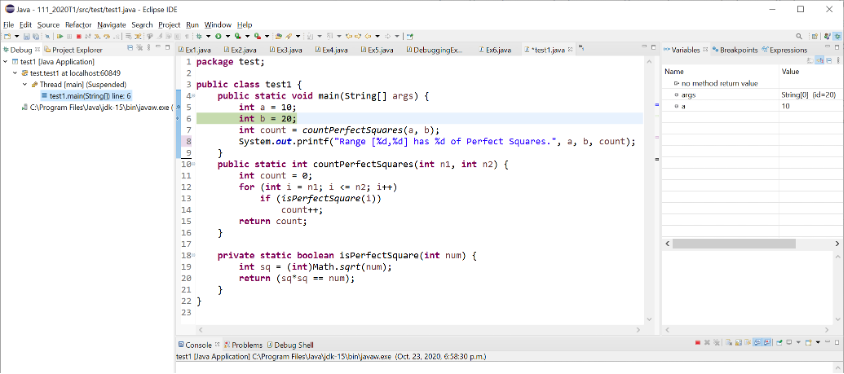

# Lab 9

## Expectations

We are expecting you to commit your work often with useful commit messages.
This is helpful for you so that there are regular commits that demonstrate your progress. 
In case you forget to push your final commits before the deadline, at least you will get partial marks.

This means that you should commit and push your changes to the repository at least **FIVE** times as you work this lab (more is recommended).
Repositories that have very few commits will be flagged for careful scrutiny and review, and you will **definitely** lose marks for this! 

## Q1: [10 marks] Converting Time

Create a method that transforms a time given in seconds to a String that shows the hours, minutes, and seconds like the time on a digital clock.
The String returned from the method shows the time as hours:minutes:seconds. 

Use the following header as a starting point:

```
public static String convertTime(int totalSeconds)
```

Write a test program that asks the user for the time in second then displays the time in hours:minutes:seconds.

*Hint: Use the / operator to get the number of minutes, and the % operator to get the number of seconds left over.*

### Sample Output



## Q2: [10 marks] Triangle Area with classes

Write a class with 2 methods.
The first method determines if any two sides added together are greater than the remaining side.
The second method calculates the triangle’s area.

### Method 1: Return true if the sum of every two sides is greater than the third.

Use the following header as a starting point:

```
public static boolean isValid(double sid1, double side2, double side3)
```

### Method 2: Return the triangle area

Use the following header as a starting point:

```
public static double area(double side1, double side2, double side3)
```

Develop a test program that takes in the three sides of a triangle and uses the `isValid()` method to determine if the input is valid according to the above criteria.
If the inputs are valid display the area. Otherwise display an error message and continue to ask for inputs until a valid set is received. 

The formula for computing the area of a triangle is as follows:



*Hint: use a while loop to check the validity of the user’s input.*

### Sample Output



## Q3: [10 marks] Palindromes

Create two methods: one that will reverse the order of the digits in an integer and a second determines if a number is a palindrome (i.e. reads the same front to back) using the following method headers.

### Method 1: Takes in an integer and reverses it, e.g., reverse(456) returns 654

Use the following header as a starting point:

```
public static int reverse(int number)
```

### Method 2: Takes in an integer and returns true if it is a palindrome. 

Use the reverse method you just wrote to implement this method.

```
public static boolean isPalindrome(int number)
```

Create a test program that asks the user to input an integer and provides feedback on whether the integer is a palindrome or not. 

Hint: To find the reverse number, use one of the following approaches:

- Modify your numerical inputs to a string, then use a for loop to reverse the characters with string concatenation and the charAt() method.
- Retrieve individual digits and combine them in reverse order using the / and % operators, using ten as a divisor. Combine the digits with either mathematically or with string concatenation. 

### Sample Output



## Q4

[6 marks] This question has a quick tutorial on the Eclipse Debugger tool.

1. Copy the code below into Eclipse. Set a breakpoint on the line int b = 20; 
This is where you want to start to observe how your program proceeds.

```
public static void main(String[] args) {
	int a = 10;
	int b = 20;
	int count = countPerfectSquares(a, b);
	System.out.printf("Range [%d,%d] has %d of Perfect Squares.", a, b, count);
}
public static int countPerfectSquares(int n1, int n2) {
	int count = 0;
	for (int i = n1; i <= n2; i++) 
		if (isPerfectSquare(i)) 
			count++;
	return count;
}
private static boolean isPerfectSquare(int num) {
	int sq = (int)Math.sqrt(num);
	return (sq*sq == num);
}
```

2. Start the Eclipse debugger (or the debugger in your preferred IDE). As soon as Eclipse reaches the breakpoint, it will pause the program and wait for your instructions.

3. Single-step through your program, tracing the code and observing how the variables change.

Do the following as you trace your code: 

1. Take screenshots right after each of the main method’s variables, b and count, have changed. For example, the screenshot below is taken once ‘a’ has changed (i.e. has been initialized). Your screenshots should be right after lines 6 and 7 have been finished executing.  

2. Take screenshots right after you step into each of the methods countPerfectSquares() and isPerfectSquare(). Highlight in your screenshots the stack trace (the left part that shows the list of method calls).

3. You should now have four screenshots: 2 from step (1) above and 2 from step (2). 
Add your screenshots into this GitHub repository, and also link to them in this markdown file (README.md).



## Grading area

### Link to files

You do not have to do anything in this section.

[Q1 Java file](./Q1.java)

[Q2 Java file](./Q2.java)

[Q3 Java file](./Q3.java)

[Q4 Java file](./Q4.java)

Remember to commit all your changes and to submit the link to this repository on Canvas.
